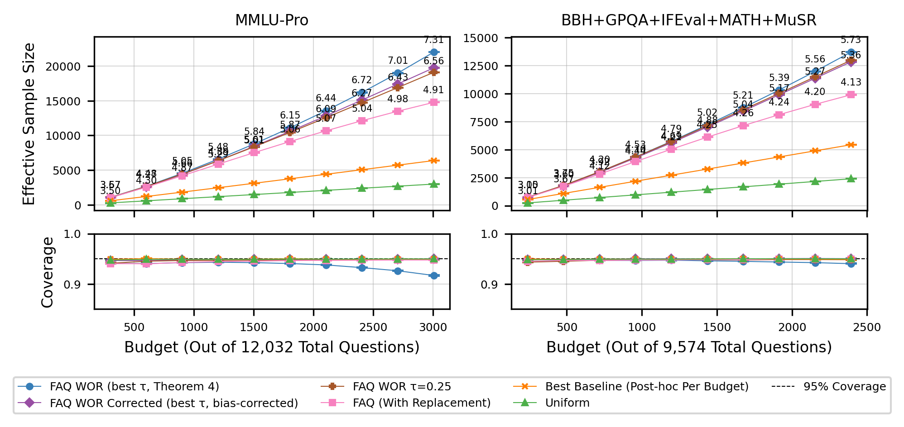

# Bias Correction for the WOR-PAI Variance Estimator

**Technical Note — May 2026**

*This note focuses exclusively on the construction, analysis, and validation of the correction term $\hat{C}_n$. For the derivation of $\Lambda$, the coverage formula, and the $\tau$ experiments, see `wor_coverage_analysis.md`.*

---

## 1. Starting Point

The WOR-PAI variance estimator (Theorem 4) is $\hat{\sigma}^2 = \hat{A}_n - \hat{B}_n$. The analysis in `wor_coverage_analysis.md` establishes that $\hat{B}_n$ is positively biased:

$$\mathbb{E}[\hat{B}_n] - B_n = \mathbb{E}[T_1] + \mathbb{E}[T_2] - \mathbb{E}[T_3]$$

where the dominant term is

$$\mathbb{E}[T_1] = \frac{1}{n}\sum_{s=1}^{n-1}\mathbb{E}[v_s]\,w_s, \qquad w_s := \sum_{k=s}^{n-1}\frac{1}{k^2}$$

with $v_s := \mathbb{E}[\Delta_s^2 \mid \mathcal{F}_{s-1}]$ the per-step conditional variance and $\Delta_s = \phi_s - \theta$ the martingale increment. This bias causes $\hat{\sigma}^2$ to underestimate $\bar{\sigma}^2$, and coverage to degrade from 0.950 to 0.917 (MMLU-Pro, 25% budget).

The goal of this note: construct a term $\hat{C}_n$ such that $\hat{\sigma}^2_{\text{cor}} := \hat{A}_n - \hat{B}_n + \hat{C}_n$ is unbiased (or slightly conservative) with a provably small residual.

---

## 2. The Exact Decomposition $\hat{B}_n - B_n = T_1 + T_2 - T_3$

$\hat{B}_n$ replaces the true mean $\theta$ with the running estimate $\hat{\theta}_{t-1}$. The exact algebraic identity (no expectations) for each $t \geq 2$ is:

$$(\hat{\theta}_{t-1} - \psi_t)^2 - (\theta - \psi_t)^2 = (\hat{\theta}_{t-1} - \theta)^2 + 2(\hat{\theta}_{t-1} - \theta)(\theta - \psi_t)$$

This is just $(a+b)^2 - b^2 = a^2 + 2ab$ with $a = \hat{\theta}_{t-1} - \theta$ and $b = \theta - \psi_t$. Note that $\psi_t$ is random (it depends on $O_{t-1}$), so the cross term $2(\hat{\theta}_{t-1} - \theta)(\theta - \psi_t)$ does **not** vanish — neither pathwise nor in expectation.

Summing over $t = 2, \ldots, n$ and dividing by $n$:

$$\frac{1}{n}\sum_{t=2}^n \left[(\hat{\theta}_{t-1} - \psi_t)^2 - (\theta - \psi_t)^2\right] = \underbrace{\frac{1}{n}\sum_{t=2}^n (\hat{\theta}_{t-1} - \theta)^2}_{T_1} + \underbrace{\frac{2}{n}\sum_{t=2}^n (\hat{\theta}_{t-1} - \theta)(\theta - \psi_t)}_{T_2}$$

Additionally, $\hat{B}_n$ sums from $t = 2$ while $B_n$ sums from $t = 1$. The missing $t = 1$ term gives:

$$T_3 := \frac{1}{n}\left(\theta - \frac{1}{N}\sum_i \hat{f}^{(0)}(x_i)\right)^2$$

Combining: $\hat{B}_n - B_n = T_1 + T_2 - T_3$ **exactly** (pathwise, for every realization).

### Why $T_1$ dominates

All three terms contribute to $\mathbb{E}[\hat{B}_n - B_n] = \mathbb{E}[T_1] + \mathbb{E}[T_2] - \mathbb{E}[T_3]$, but their magnitudes differ by orders of magnitude:

**$T_1$ (noise floor).** $T_1 \geq 0$ always. Its expectation is $\mathbb{E}[T_1] = \frac{1}{n}\sum_{t=2}^n \text{Var}(\hat{\theta}_{t-1})$, which equals $\frac{1}{n}\sum_{s=1}^{n-1}\mathbb{E}[v_s]\,w_s$ after the sum exchange (§3). At MMLU-Pro 25% with $\tau = 0.05$: $\mathbb{E}[T_1]/\bar{\sigma}^2 \approx 0.22$.

**$T_3$ (initial model error).** $T_3$ is deterministic (depends only on the initial model $\hat{f}^{(0)}$) and enters with a minus sign, partially offsetting the bias. In normalized units: $T_3/\bar{\sigma}^2 = (\theta - \bar{\psi}_1)^2/(n\bar{\sigma}^2)$. The $1/n$ factor makes this $O(10^{-6})$ — negligible.

**$T_2$ (cross-correlation).** Since $\mathbb{E}[\hat{\theta}_{t-1}] = \theta$, each term is a covariance: $\mathbb{E}[(\hat{\theta}_{t-1} - \theta)(\theta - \psi_t)] = -\text{Cov}(\hat{\theta}_{t-1}, \psi_t)$. Now $\psi_1$ is deterministic (fixed initial model), so $\text{Cov}(\hat{\theta}_{t-1}, \psi_t) = \text{Cov}(\hat{\theta}_{t-1}, \psi_t - \psi_1)$. The covariance arises because sampling item $I_s$ at step $s$ affects both:
- $\hat{\theta}$, via the AIPW increment $r_{I_s}/(N q_s(I_s))$ — amplified by $1/q_s$
- $\psi_{s+1} - \psi_s \approx r_{I_s}/N$ — amplified only by $1/N$

The conditional covariance from this shared randomness at step $s$ is:

$$\text{Cov}\!\left(\frac{r_{I_s}}{Nq_s(I_s)},\; \frac{r_{I_s}}{N}\;\middle|\;\mathcal{F}_{s-1}\right) = \frac{1}{N^2}\left[\sum_{i \notin O_{s-1}} r_i^2 - \left(\sum_i r_i\right)\!\left(\sum_i q_s(i)\,r_i\right)\right] \;\approx\; \frac{\overline{r^2}}{N}$$

where $\overline{r^2} = \frac{1}{M}\sum r_i^2$ is the mean squared residual. The key: this is $\sim v_s / N$ (the per-step variance scaled down by $1/N$). This per-step covariance propagates through the running average with harmonic weights $\sim 1/(t-1)$ for later rounds. After the double-sum bookkeeping:

$$|\mathbb{E}[T_2]| \;\lesssim\; \frac{\ln(n)}{N}\cdot\frac{1}{n}\sum_{s=1}^{n-1} v_s \;=\; \frac{\bar{\sigma}^2\ln(n)}{N}$$

For $n = 3000$, $N = 12{,}000$, $\bar{\sigma}^2 \sim 10^{-4}$: $|\mathbb{E}[T_2]| \lesssim 10^{-4} \times 8 / 12{,}000 \sim 10^{-7}$.

**Summary:** $\mathbb{E}[\hat{B}_n - B_n] \approx \mathbb{E}[T_1]$ with the approximation error $|\mathbb{E}[T_2]| \lesssim 10^{-7}$ and $\mathbb{E}[T_3] \lesssim 10^{-6}$, both negligible compared to $\mathbb{E}[T_1] \sim 10^{-5}$. The fix targets $T_1$: subtract an estimate of $\text{Var}(\hat{\theta}_{t-1})$ for each $t$.

---

## 3. Estimating $\text{Var}(\hat{\theta}_{t-1})$

By the martingale structure (orthogonality of $\Delta_s$ for different $s$):

$$\text{Var}(\hat{\theta}_{t-1}) = \frac{1}{(t-1)^2}\sum_{s=1}^{t-1}\mathbb{E}[v_s]$$

We need an estimator of each $\mathbb{E}[v_s]$. The natural candidate is $a_s^2/N^2$ where $a_s := (y_{I_s} - \hat{f}^{(s-1)}_{I_s})/q_s(I_s)$ is the AIPW increment already computed at step $s$.

**Why $a_s^2/N^2$ estimates $v_s$.**

$$\mathbb{E}\!\left[\frac{a_s^2}{N^2}\,\middle|\,\mathcal{F}_{s-1}\right] = \frac{1}{N^2}\sum_{i \notin O_{s-1}} q_s(i)\,\frac{(y_i - \hat{f}^{(s-1)}_i)^2}{q_s(i)^2} = \frac{1}{N^2}\sum_{i \notin O_{s-1}} \frac{(y_i - \hat{f}^{(s-1)}_i)^2}{q_s(i)} = A_s$$

And $A_s = v_s + B_s$ where $B_s := \frac{1}{N^2}\!\left(\sum_{i \notin O_{s-1}}(y_i - \hat{f}^{(s-1)}_i)\right)^2$ is the per-step population $B$. So $a_s^2/N^2$ is an unbiased estimator of $A_s$, which overestimates $v_s$ by $B_s$.

**Why $B_s \ll A_s$ (and hence $B_s \ll v_s$).** Both $A_s$ and $B_s$ have the same $(N-s+1)^2/N^2$ scaling. To see this, let $M = N - s + 1$ be the number of remaining items, $\bar{r} = \frac{1}{M}\sum_{i \notin O} r_i$ the mean residual, and $\overline{r^2} = \frac{1}{M}\sum_{i \notin O} r_i^2$ the mean squared residual. Then:

$$B_s = \frac{M^2\bar{r}^2}{N^2}, \qquad A_s^{\,\text{unif}} = \frac{M^2\overline{r^2}}{N^2}$$

The ratio does not depend on $N$ at all:

$$\frac{B_s}{A_s^{\,\text{unif}}} = \frac{\bar{r}^2}{\overline{r^2}} = \frac{\bar{r}^2}{\sigma_r^2 + \bar{r}^2}$$

where $\sigma_r^2 = \overline{r^2} - \bar{r}^2$ is the variance of residuals across items. This is small iff **the mean residual is small relative to the spread of residuals** — a model calibration property, not an $N$-scaling property. For binary $y_i \in \{0, 1\}$ with predictions $\hat{f}_i \in [0,1]$:
- $\overline{r^2}$ is the Brier score, typically $\sim 0.1$–$0.25$ (at least $p(1-p)$ even for a constant predictor)
- $\bar{r} = \bar{y} - \bar{\hat{f}}$ is the calibration error of the model

BLR (fitted by maximum likelihood) is approximately calibrated, so $|\bar{r}| \lesssim 0.01$. This gives $B_s/A_s \lesssim (0.01)^2/0.2 = 0.05\%$. Since $v_s = A_s - B_s$ and $B_s \ll A_s$, we have $B_s/v_s \approx B_s/A_s \lesssim 0.05\%$.

For active sampling ($\tau < 1$), $A_s \geq A_s^{\,\text{unif}}$ (items with large $|r_i|$ get oversampled, increasing $\sum r_i^2/q_s(i)$ relative to uniform). So $B_s/A_s \leq B_s/A_s^{\,\text{unif}} = \bar{r}^2/\overline{r^2}$ — the bound still holds.

This gives the estimator for the noise floor:

$$\widehat{\mathrm{Var}}(\hat{\theta}_{t-1}) := \frac{1}{(t-1)^2\,N^2}\sum_{s=1}^{t-1} a_s^2$$

---

## 4. Construction of $\hat{C}_n$

Sum the estimated noise floors over all terms $t = 2, \ldots, n$ of $\hat{B}_n$, with the same $1/n$ prefactor:

$$\hat{C}_n := \frac{1}{n}\sum_{t=2}^n \widehat{\mathrm{Var}}(\hat{\theta}_{t-1}) = \frac{1}{nN^2}\sum_{t=2}^n \frac{1}{(t-1)^2}\sum_{s=1}^{t-1}a_s^2$$

### 4.1 Closed-Form via Sum Exchange

The double sum runs over pairs $(s, t)$ with $1 \leq s \leq t-1 \leq n-1$, equivalently $s \in \{1,\ldots,n-1\}$ and $t \in \{s+1,\ldots,n\}$. Exchanging summation order:

$$\sum_{t=2}^n \frac{1}{(t-1)^2}\sum_{s=1}^{t-1} a_s^2 = \sum_{s=1}^{n-1} a_s^2 \sum_{t=s+1}^{n}\frac{1}{(t-1)^2} = \sum_{s=1}^{n-1} a_s^2 \sum_{k=s}^{n-1}\frac{1}{k^2}$$

where we substituted $k = t-1$. Therefore:

$$\boxed{\hat{C}_n = \frac{1}{nN^2}\sum_{s=1}^{n-1} a_s^2\,w_s, \qquad w_s := \sum_{k=s}^{n-1}\frac{1}{k^2}}$$

**These are exactly the same weights $w_s$ as in $\Lambda = \frac{1}{\bar{\sigma}^2}\sum_{s=1}^{n-1}\mathbb{E}[v_s]\,w_s$.** This is not a coincidence: both $\hat{C}_n$ and $\mathbb{E}[T_1]$ arise from the same sum-exchange on the double sum $\sum_t \frac{1}{(t-1)^2}\sum_{s<t}(\cdot)$, so they share their weighting structure.

The **corrected estimator** is:

$$\boxed{\hat{\sigma}^2_{\mathrm{cor}} := \hat{A}_n - \hat{B}_n + \hat{C}_n}$$

### 4.2 Implementation

At step $t$, the quantity $\texttt{varhats\_main} = \sum_{s=1}^{t-1} a_s^2$ is already accumulated (it is used to compute $\hat{A}_n$). The correction needs only:

```python
# Before updating varhats_main with the new a_t^2 at step t (t >= 1):
varhats_correction += varhats_main / (t ** 2)
```

After the loop: $\hat{C}_n = \texttt{varhats\_correction} \,/\, (n \cdot N^2)$.

Cost: one tensor addition per step. No additional data storage or model calls needed.

---

## 5. Bias Analysis of $\hat{\sigma}^2_{\mathrm{cor}}$

### 5.1 Expectation of $\hat{C}_n$

$$\mathbb{E}[\hat{C}_n] = \frac{1}{nN^2}\sum_{s=1}^{n-1}\mathbb{E}[a_s^2]\,w_s = \frac{1}{n}\sum_{s=1}^{n-1}\mathbb{E}\!\left[\frac{a_s^2}{N^2}\right]w_s = \frac{1}{n}\sum_{s=1}^{n-1} A_s\,w_s$$

where we used the tower property $\mathbb{E}[a_s^2/N^2] = \mathbb{E}[\mathbb{E}[a_s^2/N^2 \mid \mathcal{F}_{s-1}]] = \mathbb{E}[A_s]$.

### 5.2 The Residual: $\hat{C}_n$ Slightly Over-Corrects

Since $A_s = v_s + B_s$:

$$\mathbb{E}[\hat{C}_n] = \frac{1}{n}\sum_{s=1}^{n-1} v_s\,w_s + \frac{1}{n}\sum_{s=1}^{n-1} B_s\,w_s = \mathbb{E}[T_1] + \underbrace{\frac{1}{n}\sum_{s=1}^{n-1} B_s\,w_s}_{=:\,R_C \,\geq\, 0}$$

The residual $R_C \geq 0$ because both $B_s \geq 0$ and $w_s > 0$.

### 5.3 Full Bias of $\hat{\sigma}^2_{\mathrm{cor}}$

$$\mathbb{E}[\hat{\sigma}^2_{\mathrm{cor}}] = \mathbb{E}[\hat{A}_n] - \mathbb{E}[\hat{B}_n] + \mathbb{E}[\hat{C}_n]$$

$$= \bar{\sigma}^2 - \bigl(\mathbb{E}[T_1] + \mathbb{E}[T_2] - \mathbb{E}[T_3]\bigr) + \bigl(\mathbb{E}[T_1] + R_C\bigr)$$

$$\boxed{\mathbb{E}[\hat{\sigma}^2_{\mathrm{cor}}] = \bar{\sigma}^2 + R_C - \mathbb{E}[T_2] + \mathbb{E}[T_3]}$$

The dominant original bias $\mathbb{E}[T_1]$ cancels exactly. The remaining terms are:

| Term | Sign | Magnitude | Effect on coverage |
|:---|:---:|:---:|:---:|
| $R_C = \frac{1}{n}\sum B_s w_s$ | $+$ | $\sim 10^{-8}$ | Conservative (overestimates $\bar\sigma^2$) |
| $-\mathbb{E}[T_2]$ | $\pm$ | $O(\bar\sigma^2\ln n/N) \sim 10^{-7}$ | Negligible ($N \sim 12\text{k}$) |
| $+\mathbb{E}[T_3]$ | $+$ | $O(1/n)$ | Conservative |

All remaining terms push $\mathbb{E}[\hat{\sigma}^2_{\mathrm{cor}}] \geq \bar{\sigma}^2$: the corrected estimator is **slightly conservative**.

### 5.4 Quantifying the Residual $R_C$

$R_C = \frac{1}{n}\sum_{s=1}^{n-1} B_s\,w_s$. Compare with the original bias $\mathbb{E}[T_1] = \frac{1}{n}\sum_{s=1}^{n-1} v_s\,w_s$:

$$\frac{R_C}{\mathbb{E}[T_1]} = \frac{\sum B_s\,w_s}{\sum v_s\,w_s} \leq \max_s \frac{B_s}{v_s}$$

Empirically, $B_s/v_s \lesssim 0.5\%$ at all steps and budgets (MMLU-Pro, BBH). Therefore:

$$R_C \leq 0.005 \times \mathbb{E}[T_1]$$

The residual is at least $200\times$ smaller than the original bias. Coverage is overcorrected by at most $0.114 \times R_C/\bar{\sigma}^2 \lesssim 0.114 \times 0.005 \times \Lambda/n$. At MMLU-Pro 25% ($\Lambda/n = 0.22$), this is $\lesssim 0.00013$ — not detectable at 100 seeds.

### 5.5 Direction of the Residual: Why It Is Conservative

For BBH at high budgets, where theorem4 had $\varepsilon > 0$ (anti-conservative), the corrected estimator achieves $\varepsilon$ slightly negative (e.g., $\varepsilon = -0.001$ at 25%), meaning coverage is $0.9501$ instead of exactly $0.9500$. This is the empirical signature of $R_C > 0$: the corrected estimator is systematically $R_C/\bar{\sigma}^2$ above unbiasedness, producing CIs that are slightly too wide.

This is a desirable property: the error is in the safe direction (conservative), bounded, and of known sign from the theory.

---

## 6. Empirical Validation

### 6.1 Setup

All (dataset, budget, seed) combinations from the main WOR FAQ experiment, re-run with `variance_mode="corrected"` and `variance_mode="A_only"`, keeping the same tuned hyperparameters from `wor_best_settings.csv` (100 seeds per configuration).

$\varepsilon$ is recovered from empirical coverage via $\varepsilon = 1 - \Phi^{-1}((1 + \mathrm{cov})/2)/z_{0.975}$. Positive $\varepsilon$ = anti-conservative; negative = conservative. Width overhead is relative to `theorem4`.

### 6.2 MMLU-Pro ($\tau_{\mathrm{tuned}} = 0.05$, $N = 12{,}032$)

| Budget | theorem4 ($\varepsilon$) | corrected ($\varepsilon$) | A\_only ($\varepsilon$) | width $+\%$ |
|:---:|:---:|:---:|:---:|:---:|
| 2.5% | 0.941 (+0.037) | 0.947 (+0.014) | 0.945 (+0.020) | +2.3% |
| 5% | 0.941 (+0.038) | 0.947 (+0.015) | 0.946 (+0.019) | +2.1% |
| 7.5% | 0.942 (+0.032) | 0.948 (+0.008) | 0.947 (+0.011) | +1.8% |
| 10% | 0.943 (+0.028) | 0.949 (+0.005) | 0.948 (+0.008) | +1.8% |
| 12.5% | 0.942 (+0.031) | 0.949 (+0.004) | 0.948 (+0.007) | +2.0% |
| 15% | 0.941 (+0.038) | 0.949 (+0.004) | 0.949 (+0.006) | +2.3% |
| 17.5% | 0.938 (+0.048) | 0.949 (+0.004) | 0.949 (+0.006) | +2.9% |
| 20% | 0.932 (+0.067) | 0.949 (+0.007) | 0.948 (+0.008) | +3.5% |
| 22.5% | 0.926 (+0.088) | 0.949 (+0.003) | 0.949 (+0.005) | +4.4% |
| **25%** | **0.917 (+0.116)** | **0.950 (+0.001)** | **0.949 (+0.006)** | **+5.6%** |

### 6.3 BBH+GPQA+IFEval+MATH+MuSR ($\tau_{\mathrm{tuned}} \approx 0.25$, $N = 9{,}574$)

| Budget | theorem4 ($\varepsilon$) | corrected ($\varepsilon$) | A\_only ($\varepsilon$) | width $+\%$ |
|:---:|:---:|:---:|:---:|:---:|
| 2.5% | 0.945 (+0.022) | 0.949 (+0.007) | 0.948 (+0.010) | +1.5% |
| 5% | 0.947 (+0.014) | 0.948 (+0.008) | 0.949 (+0.007) | +1.1% |
| 7.5% | 0.947 (+0.013) | 0.949 (+0.003) | 0.950 (+0.002) | +1.0% |
| 10% | 0.947 (+0.014) | 0.950 (+0.001) | 0.949 (+0.003) | +1.0% |
| 12.5% | 0.947 (+0.011) | 0.950 ($-$0.001) | 0.950 ($-$0.000) | +1.1% |
| 15% | 0.946 (+0.017) | 0.950 (+0.001) | 0.950 (+0.001) | +1.4% |
| 17.5% | 0.945 (+0.021) | 0.950 (+0.001) | 0.950 (+0.001) | +1.7% |
| 20% | 0.944 (+0.026) | 0.950 ($-$0.001) | 0.950 ($-$0.000) | +2.1% |
| 22.5% | 0.942 (+0.031) | 0.951 ($-$0.002) | 0.950 ($-$0.001) | +2.7% |
| **25%** | **0.940 (+0.039)** | **0.950 ($-$0.001)** | **0.950 (+0.001)** | **+3.3%** |

### 6.4 Key Observations

**1. Corrected fully resolves coverage.** On MMLU-Pro 25%, $\varepsilon$ drops from $+0.116$ to $+0.001$: a $99\%$ reduction in the bias. On BBH 25%, $+0.039 \to -0.001$. At all budgets $\geq 10\%$, $|\varepsilon| \leq 0.007$ for both datasets.

**2. Negative $\varepsilon$ for BBH confirms the conservative residual $R_C$.** BBH uses tuned $\tau \approx 0.25$ so $\Lambda/n$ is small, and $\hat{C}_n$ slightly over-corrects as predicted. The overcorrection is at most $-0.002$ (coverage $0.9502$ vs target $0.9500$) — negligible in practice.

**3. Low-budget residual is irreducible.** At 2.5%–7.5%, corrected still shows $\varepsilon \approx 0.007$–$0.015$ for MMLU-Pro. This is $R_{\mathrm{CLT}} \sim C/\sqrt{n}$: the CLT approximation error shared by all methods. It is not caused by $\hat{B}_n$ bias and cannot be removed by $\hat{C}_n$.

**4. A\_only is uniformly conservative ($\varepsilon \geq 0$) but less accurate.** The `A_only` estimator sets $\hat{\sigma}^2 = \hat{A}_n$ (ignoring $\hat{B}_n$ entirely). Its $\varepsilon$ is 0.006 at MMLU-Pro 25% vs corrected's 0.001. The width overhead is essentially identical (both avoid computing $\hat{B}_n$ corrections at the same computational cost). Corrected is strictly more accurate.

**5. ESS overhead is modest.** The corrected CI is wider by $w\%$, reducing the ESS multiplier by the same factor: at MMLU-Pro 25%, ESS drops from $7.31\times$ to $\approx 6.9\times$. This still dominates WR FAQ ($4.91\times$) by $41\%$.

---

## 7. Figure



*Coverage (bottom) and ESS (top) for MMLU-Pro (left) and BBH (right). Blue circles: WOR Theorem 4. Purple diamonds: WOR Corrected. Brown pentagons: WOR $\tau = 0.25$ (fixed). Pink squares: WR FAQ. Orange crosses: best baseline. Dashed: 95% target.*

The figure demonstrates three facts simultaneously:
- The blue curve's degrading coverage is entirely explained by growing $\Lambda/n$
- The purple curve restores coverage to nominal with minimal ESS loss
- The brown curve also restores coverage but at greater ESS cost (because forcing $\tau = 0.25$ reduces sampling concentration, while corrected preserves the original $\tau = 0.05$)

---

## 8. Comparison with the $\tau$ Fix

Both $\hat{C}_n$ and raising $\tau$ solve the coverage problem. The distinction:

| Property | $\hat{C}_n$ correction | $\tau = 0.25$ fix |
|:---|:---:|:---:|
| Changes sampling design? | No | Yes |
| Changes hyperparameter search? | No | Yes (re-tune) |
| ESS cost vs theorem4 (MMLU 25%) | $-5.6\%$ width $\approx -5.5\%$ ESS | $-13\%$ ESS |
| Coverage accuracy $|\varepsilon|$ at 25% | $\leq 0.001$ | $\leq 0.002$ |
| Residual bias direction | Conservative ($R_C > 0$) | Conservative ($\Lambda$ smaller) |
| Works for all $\tau$ values? | Yes | Only for $\tau \geq 0.25$ |

The correction is preferable: it is a post-hoc fix to the variance formula that requires no change to the sampling policy or hyperparameter search. It is essentially free (one extra accumulation per step) and works regardless of what $\tau$ was selected during tuning.

The $\tau$ fix remains useful during **validation tuning**: if the validation metric is empirical coverage, running with $\tau = 0.05$ will yield anti-conservative coverage estimates that steer the optimizer toward bad configurations. Using $\tau \geq 0.25$ or `variance_mode="corrected"` during tuning ensures the validation oracle is reliable.
